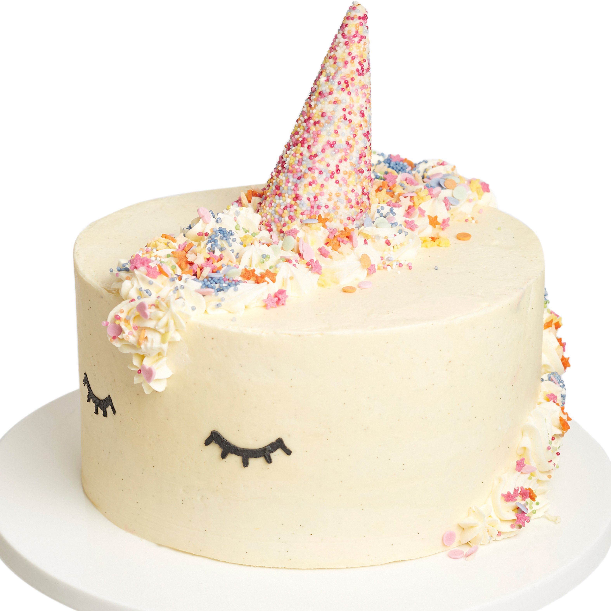

<html>
<head>
<title>Page Title</title>

</head>
<body>

<h1>HAPPY HAPPY BIRTHDAY!</h1>

<audio id="hb_audio" src="happybirthday.mp3" loop="loop"></audio>

<button onclick="startBirthday();">Start</button>

<button onclick="stopBirthday();">Stop</button>

</body>
</html>
